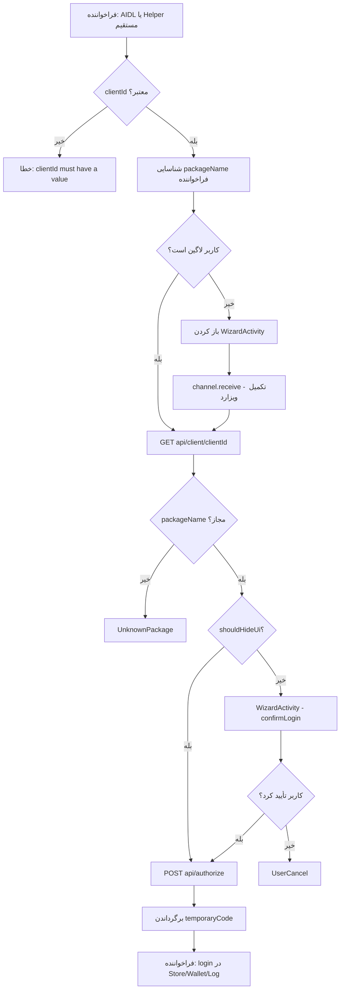

# مستندات `LoginWithDoneService`

## فهرست مطالب

1. [معرفی کلی](#معرفی-کلی)
2. [ساختار و وابستگی‌ها](#ساختار-و-وابستگی‌ها)
3. [ثبت در Manifest](#ثبت-در-manifest)
4. [رابط AIDL](#رابط-aidl)
5. [منطق `LoginWithDoneService`](#منطق-loginwithdoneservice)
6. [مدل پاسخ `TemporaryCodeResponse`](#مدل-پاسخ-temporarycoderesponse)
7. [منطق اصلی در `LoginWithDoneHelper`](#منطق-اصلی-در-loginwithdonehelper)
8. [نقش `WizardActivity`](#نقش-wizardactivity)
9. [نقاط استفاده در پروژه](#نقاط-استفاده-در-پروژه)
10. [نحوه استفاده برای اپلیکیشن‌های خارجی](#نحوه-استفاده-برای-اپلیکیشن‌های-خارجی)
11. [نمودار جریان کلی](#نمودار-جریان-کلی)
12. [کارهایی که باید انجام دهید (راهنمای توسعه‌دهنده)](#کارهایی-که-باید-انجام-دهید-راهنمای-توسعه‌دهنده)

---

## معرفی کلی

`LoginWithDoneService` یک **سرویس اندروید صادرشده (exported)** است که امکان **ورود یکپارچه با اکوسیستم Done/Huma** را برای اپلیکیشن‌های دیگر (از طریق AIDL) و همچنین برای ماژول‌های داخلی پروژه فراهم می‌کند.

**هدف اصلی:** دریافت یک `clientId` از فراخواننده، اجرای فرآیند احراز هویت/ویزارد در صورت نیاز، و برگرداندن یک **کد موقت (temporary code)** به صورت JSON که اپلیکیشن فراخواننده می‌تواند با آن در سرور خود لاگین کند.

> **نکته مهم درباره نام‌گذاری:** کلاس `LoginWithDoneService` در فایل `LoginWithHumaService.kt` تعریف شده است. این ناهماهنگی نام فایل و کلاس می‌تواند در جستجو و نگهداری کد گیج‌کننده باشد.

**مسیر فایل:**

```
auth/src/main/kotlin/ir/huma/humastore/auth/core/LoginWithHumaService.kt
```

---

## ساختار و وابستگی‌ها

| جزء | نقش |
|-----|-----|
| `LoginWithDoneService` | نقطه ورود سرویس؛ پیاده‌سازی AIDL و تبدیل نتیجه به JSON |
| `ILoginWithHumaService` (AIDL) | قرارداد IPC بین اپ خارجی و HumaStore |
| `LoginWithDoneHelper` | منطق واقعی لاگین، ویزارد، API و Channel همگام‌سازی |
| `WizardActivity` | UI ویزارد (OTP، پروفایل، تأیید لاگین و ...) |
| `StartWizardActivity` | نقطه ورود Deep Link / Intent برای لاونچر |
| `LoginWithDoneModel` | مدل اطلاعات سرویس/کلاینت از سرور |
| `ProfileApi` | فراخوانی‌های شبکه `getServiceInfoForLogin` و `authorizeWithHuma` |
| `WizardRepository` | بررسی وضعیت لاگین کاربر (وجود token در SharedPreferences) |

---

## ثبت در Manifest

سرویس در ماژول `auth` ثبت شده و **exported** است؛ یعنی اپ‌های دیگر می‌توانند به آن bind شوند.

```51:60:auth/src/main/AndroidManifest.xml
        <service
            android:name=".core.LoginWithDoneService"
            android:enabled="true"
            android:exported="true"
            tools:ignore="ExportedService">
            <intent-filter>
                <action android:name="ir.huma.humastore.loginWithHuma" />
                <category android:name="android.intent.category.OPENABLE" />
            </intent-filter>
        </service>
```

**Action برای bind:**

```
ir.huma.humastore.loginWithHuma
```

---

## رابط AIDL

```1:5:auth/src/main/aidl/ir/huma/humastore/ILoginWithHumaService.aidl
package ir.huma.humastore;

interface ILoginWithHumaService {
    String startLogin(String clientId);
}
```

تنها متد عمومی: `startLogin(clientId)` که یک **رشته JSON** از نوع `TemporaryCodeResponse` برمی‌گرداند.

---

## منطق `LoginWithDoneService`

### 1. `onBind`

با bind شدن سرویس، یک `Stub` از `ILoginWithHumaService` برگردانده می‌شود.

### 2. `startLogin(clientId)`

```25:38:auth/src/main/kotlin/ir/huma/humastore/auth/core/LoginWithHumaService.kt
    private val binder: ILoginWithHumaService.Stub = object : ILoginWithHumaService.Stub() {
        override fun startLogin(clientId: String?): String {
            val callerPackageName = getPackageNameOfCaller(this@LoginWithDoneService)
            Timber.i("startLogin: $callerPackageName")
            val response = runBlocking(Dispatchers.Main) {
                return@runBlocking if (clientId == null)
                    TemporaryCodeResponse(false, "clientId must have a value!")
                else LoginWithDoneHelper.getInstance(
                    clientId, this@LoginWithDoneService
                ).login(callerPackageName, true)
            }

            return json.encodeToString(response)
        }
    }
```

**مراحل:**

1. **شناسایی فراخواننده:** `getPackageNameOfCaller()` با `Binder.getCallingUid()` نام پکیج اپ caller را می‌گیرد.
2. **اعتبارسنجی `clientId`:** اگر `null` باشد، خطا برمی‌گردد.
3. **اجرای لاگین:** `LoginWithDoneHelper.login(callerPackageName, showWizard = true)` — یعنی برای فراخواننده‌های خارجی **ویزارد همیشه مجاز است**.
4. **سریال‌سازی:** نتیجه با `kotlinx.serialization` به JSON تبدیل و برگردانده می‌شود.
5. **`runBlocking(Dispatchers.Main)`:** چون AIDL همزمان است، کل فرآیند suspend داخل blocking روی Main اجرا می‌شود.

### 3. `getPackageNameOfCaller` — منطق ویژه برای `ir.huma.user`

```41:57:auth/src/main/kotlin/ir/huma/humastore/auth/core/LoginWithHumaService.kt
    private fun getPackageNameOfCaller(context: Context): String? {
        val packageName = packageManager.getNameForUid(Binder.getCallingUid())
        if (packageName?.contains("ir.huma.user") == true) {
            return getAppNameByPID(context, Binder.getCallingPid()) ?: packageName
        }
        return packageName
    }

    private fun getAppNameByPID(context: Context, pid: Int): String? {
        val manager: ActivityManager = context.getSystemService(ACTIVITY_SERVICE) as ActivityManager
        for (processInfo in manager.runningAppProcesses) {
            if (processInfo.pid == pid) {
                return processInfo.processName
            }
        }
        return null
    }
```

**چرا این منطق وجود دارد؟**

وقتی چند اپ زیر مجموعه `ir.huma.user` از یک UID مشترک استفاده می‌کنند، `getNameForUid` ممکن است نام دقیق پکیج واقعی را ندهد. در این حالت با **PID** فرآیند فراخواننده، `processName` واقعی استخراج می‌شود تا اعتبارسنجی `packageName` در سرور درست عمل کند.

---

## مدل پاسخ `TemporaryCodeResponse`

```61:80:auth/src/main/kotlin/ir/huma/humastore/auth/core/LoginWithHumaService.kt
@Serializable
data class TemporaryCodeResponse(
    val isSuccess: Boolean,
    val errorMessage: String? = null,
    val temporaryCode: String? = null,
    val status: ResponseStatus? = null
) : java.io.Serializable {

    enum class ResponseStatus {
        Success,
        InternetError,
        ServerError,
        UserCancel,
        NeedWizard,
        UnknownPackage,
        UnknownError,
        AutoCancel
    }

}
```

| فیلد | توضیح |
|------|-------|
| `isSuccess` | موفقیت یا شکست عملیات |
| `temporaryCode` | کد موقت برای لاگین در سرویس مقصد (Store، Wallet، Log و ...) |
| `errorMessage` | پیام خطا در صورت شکست |
| `status` | دسته‌بندی نوع نتیجه برای مدیریت UI/Retry |

---

## منطق اصلی در `LoginWithDoneHelper`

فایل: `auth/src/main/kotlin/ir/huma/humastore/auth/core/LoginWithDoneHelper.kt`

### شناسه‌های از پیش تعریف‌شده Client

```24:27:auth/src/main/kotlin/ir/huma/humastore/auth/core/LoginWithDoneHelper.kt
        const val CLIENT_ID_STORE = "d541ec37148566f9691a3936180c1849"
        const val CLIENT_ID_LOG = "125c048be7c39a4e35283adadf8a0165"
        const val CLIENT_ID_WALLET = "a221eabaaf1b4e9d6a8a4afd28dc9f85"
```

| ثابت | مصرف |
|------|------|
| `CLIENT_ID_STORE` | لاگین فروشگاه (Store) |
| `CLIENT_ID_LOG` | احراز هویت ماژول Log |
| `CLIENT_ID_WALLET` | لاگین کیف پول (Wallet) |

### الگوی Singleton per `clientId`

```31:38:auth/src/main/kotlin/ir/huma/humastore/auth/core/LoginWithDoneHelper.kt
        fun getInstance(clientId: String, context: Context): LoginWithDoneHelper {
            var instance = lists.find { it.clientId == clientId }
            if (instance == null) {
                instance = LoginWithDoneHelper(clientId, context)
                lists.add(instance)
            }
            return instance
        }
```

برای هر `clientId` یک نمونه نگه‌داری می‌شود. هر نمونه یک `Channel<TemporaryCodeResponse>` دارد تا بین `login()` و `WizardActivity` همگام شود.

### متد `login(packageName, showWizard)`

```59:76:auth/src/main/kotlin/ir/huma/humastore/auth/core/LoginWithDoneHelper.kt
    suspend fun login(
        packageName: String?,
        showWizard: Boolean = true
    ): TemporaryCodeResponse {
        val result = handleLogin(packageName, showWizard)
        if (!result.isSuccess && result.errorMessage == "internet error!") {
            val intent = Intent(context, WizardActivity::class.java)
            intent.putExtra("wifiOnly", true)
            intent.addFlags(Intent.FLAG_ACTIVITY_NEW_TASK)
            context.startActivity(intent)
        }
        removeLoginHelper()
        try {
            channel.close()
        } catch (_: Exception) {
        }
        return result
    }
```

**پس از اتمام `handleLogin`:**
- اگر خطای اینترنت باشد → `WizardActivity` فقط با حالت WiFi باز می‌شود.
- نمونه Helper از لیست حذف و Channel بسته می‌شود.

### جریان `handleLogin` — هسته منطق

```
handleLogin
    │
    ├─► clientId خالی؟ → ServerError
    │
    ├─► handleWizard(showWizard, packageName)
    │       ├─ کاربر لاگین نیست؟ → WizardActivity
    │       ├─ Launcher بدون اینترنت؟ → WizardActivity
    │       ├─ showWizard=false و نیاز به ویزارد؟ → NeedWizard
    │       └─ در غیر این صورت → ادامه
    │
    ├─► getClientInfo(clientId)  [API: GET api/client/{clientId}]
    │
    ├─► handleClientData(model, packageName)
    │       ├─ packageName ناشناخته؟ → UnknownPackage
    │       ├─ shouldHideUi()? → getTemporaryCode (بدون UI)
    │       └─ در غیر این صورت → null (نیاز به UI)
    │
    ├─► startAskLoginActivity → WizardActivity با confirmLogin
    │
    └─► handleUserResponse → channel.receive() → getTemporaryCode
```

### جزئیات هر مرحله

#### الف) `handleWizard`

```153:171:auth/src/main/kotlin/ir/huma/humastore/auth/core/LoginWithDoneHelper.kt
    private suspend fun handleWizard(
        showWizard: Boolean,
        packageName: String?
    ): TemporaryCodeResponse? {
        if (!entryPoint.wizardRepository().isUserLoggedIn() || checkIfIsLauncherAndNoInternet(
                packageName
            )
        ) {
            if (!showWizard) return TemporaryCodeResponse(
                false,
                "you must start login!",
                status = TemporaryCodeResponse.ResponseStatus.NeedWizard
            )
            startWizardActivity(packageName)
            val result = channel.receive()
            if (!result.isSuccess) return result
        }
        return null
    }
```

- **`isUserLoggedIn()`:** وجود `token` در SharedPreferences پروفایل (`DefaultWizardRepository`).
- **`checkIfIsLauncherAndNoInternet`:** اگر پکیج `ir.huma.android.launcher` و اینترنت نباشد، ویزارد اجباری است.
- **`showWizard = false`:** برای فراخوانی‌های داخلی بدون UI (مثلاً Wallet/Log)؛ اگر کاربر لاگین نباشد → `NeedWizard`.

#### ب) `handleClientData` — اعتبارسنجی پکیج و UI-less login

```135:151:auth/src/main/kotlin/ir/huma/humastore/auth/core/LoginWithDoneHelper.kt
    private suspend fun handleClientData(
        loginWithHumaModel: LoginWithDoneModel,
        packageName: String?
    ): TemporaryCodeResponse? {
        if (!loginWithHumaModel.packageName.isNullOrEmpty() && loginWithHumaModel.packageName != packageName) {

            return TemporaryCodeResponse(
                false,
                "your package name is unknown!",
                status = TemporaryCodeResponse.ResponseStatus.UnknownPackage
            )
        }

        return if (loginWithHumaModel.shouldHideUi()) {
            getTemporaryCode(clientId, loginWithHumaModel.muUiType!!.getAuthVersion())
        } else null
    }
```

**`shouldHideUi()`** در `LoginWithDoneModel`:

```10:10:auth/src/main/kotlin/ir/huma/humastore/auth/core/model/LoginWithDoneModel.kt
    fun shouldHideUi() = muUiType == UiType.None || muUiType == UiType.NoneV2
```

اگر `uiType` برابر `None` یا `NoneV2` باشد، بدون نمایش UI مستقیماً کد موقت گرفته می‌شود.

#### ج) `getTemporaryCode` — دریافت کد از سرور

```205:221:auth/src/main/kotlin/ir/huma/humastore/auth/core/LoginWithDoneHelper.kt
    private suspend fun getTemporaryCode(clientId: String, version: String): TemporaryCodeResponse {
        return try {
            val result = entryPoint.profileMethods().authorizeWithHuma(
                AuthorizeApiModel(clientId), version = version
            )

            TemporaryCodeResponse(
                true, null, result.code, TemporaryCodeResponse.ResponseStatus.Success
            )
        } catch (e: Exception) {
            TemporaryCodeResponse(
                false,
                "internet error!",
                status = TemporaryCodeResponse.ResponseStatus.InternetError
            )
        }
    }
```

**API:** `POST api/{version}authorize` — نسخه `v2/` برای `NoneV2`, `HumaV2`, `NamavaV2`.

#### د) `freeChannel` — سیگنال از Wizard به Helper

```52:57:auth/src/main/kotlin/ir/huma/humastore/auth/core/LoginWithDoneHelper.kt
    suspend fun freeChannel(temporaryCodeResponse: TemporaryCodeResponse) {
        channel.send(temporaryCodeResponse)
        channel.cancel()
        channel.close()
        removeLoginHelper()
    }
```

`WizardActivity` پس از موفقیت یا لغو، این متد را صدا می‌زند تا `channel.receive()` در `handleLogin` آزاد شود.

---

## نقش `WizardActivity`

`WizardActivity` رابط کاربری ویزارد است و با `LoginWithDoneHelper` از طریق Channel هماهنگ می‌شود.

### اتصال Helper در `onCreate`

```66:74:auth/src/main/kotlin/ir/huma/humastore/auth/ui/WizardActivity.kt
            LaunchedEffect(null) {
                val clientId = intent.extras?.getString("clientId")
                val isChannelScan = intent.extras?.getBoolean("channelScan")

                if (clientId != null) loginHelper =
                    LoginWithDoneHelper.getInstance(clientId, this@WizardActivity)
                else if (isChannelScan == false)
                    cancelLogin()
            }
```

### موفقیت و لغو

```195:217:auth/src/main/kotlin/ir/huma/humastore/auth/ui/WizardActivity.kt
    suspend fun cancelLogin(status: TemporaryCodeResponse.ResponseStatus = TemporaryCodeResponse.ResponseStatus.UserCancel) {
        loginHelper?.freeChannel(
            TemporaryCodeResponse(
                false,
                "need login again!",
                status = status
            )
        )
        keepWizardOnStopActivity = true
        finish()
    }

    suspend fun successLogin() {
        loginHelper?.freeChannel(
            TemporaryCodeResponse(
                true,
                "",
                status = TemporaryCodeResponse.ResponseStatus.Success
            )
        )
        keepWizardOnStopActivity = true
        finish()
    }
```

### Auto-cancel در `onStop`

```225:235:auth/src/main/kotlin/ir/huma/humastore/auth/ui/WizardActivity.kt
    override fun onStop() {
        super.onStop()
        ...
        if (!keepWizardOnStopActivity) lifecycleScope.launch {
            delay(3000)
            cancelLogin()
        }
    }
```

اگر کاربر ویزارد را بدون تکمیل ببندد، پس از ۳ ثانیه لاگین لغو می‌شود (`UserCancel`).

---

## نقاط استفاده در پروژه

### 1. سرویس AIDL (اپ‌های خارجی)

| محل | نحوه استفاده |
|-----|--------------|
| `LoginWithDoneService` | `startLogin(clientId)` با `showWizard=true` |

### 2. استفاده مستقیم از `LoginWithDoneHelper` (داخلی)

| فایل | Client ID | `showWizard` | هدف |
|------|-----------|--------------|-----|
| `LoginHelper.kt` | `CLIENT_ID_STORE` | `false` | لاگین Store با کد موقت + `storeMethods.login()` |
| `OnboardingFragment.kt` | `CLIENT_ID_STORE` | `true` | اولین ورود کاربر به Store |
| `MainActivity.kt` | `CLIENT_ID_STORE` | — | `editProfile()` |
| `MainActivity.kt` | `CLIENT_ID_WALLET` | `false` | دریافت توکن Wallet |
| `ChooseBuyActivity.kt` | `CLIENT_ID_WALLET` | `false` | لاگین Wallet برای خرید |
| `PaymentDetailActivity.kt` | `CLIENT_ID_WALLET` | `false` | لاگین Wallet برای پرداخت |
| `DefaultSendLogRepository.kt` | `CLIENT_ID_LOG` | `false` | دریافت کد موقت برای Log |
| `StartWizardActivity.kt` | dynamic (`key`) | `true` | Deep Link / Intent از Launcher |

### 3. الگوی معمول پس از دریافت `temporaryCode`

**Store:**

```15:37:app/src/main/java/ir/huma/humastore/util/LoginHelper.kt
    suspend fun loginStoreWithProfile(tryC: Int = TRY_COUNT): Boolean {
        var tryCount = tryC
        while (tryCount > 0) {
            val result = LoginWithDoneHelper.getInstance(
                LoginWithDoneHelper.CLIENT_ID_STORE,
                AppController.context
            ).login(AppController.context.packageName, false)
            if (result.isSuccess) {
                val resLogin = RetRofitService.instance().storeMethods.login(
                    ModelNewLogin().withCode(result.temporaryCode)
                ).execute()
                ...
```

**Wallet:**

```kotlin
// الگوی تکراری در MainActivity، ChooseBuyActivity، PaymentDetailActivity
RetRofitService.instance().walletMethods.loginWithHuma(result.temporaryCode)
```

**Log:**

```106:121:log/src/main/kotlin/ir/huma/log/data/repository/DefaultSendLogRepository.kt
    override suspend fun isUserTokenAvailable(): Boolean {
        if (!logSharedPreferences.getString("token", "").isNullOrEmpty())
            return true
        val tempToken = LoginWithDoneHelper.getInstance(LoginWithDoneHelper.CLIENT_ID_LOG, context)
            .login(null, false).temporaryCode ?:  return false
        ...
```

### 4. `StartWizardActivity` — مسیر Launcher

دو مسیر ورود:

1. **Action `ir.huma.humastore.channelScan`** → فقط `WizardActivity` با `channelScan=true`
2. **Deep Link `app://login.huma.ir`** یا Intent با extraهای `key` و `package` → لاگین کامل + Broadcast پاسخ

```35:43:auth/src/main/kotlin/ir/huma/humastore/auth/ui/StartWizardActivity.kt
                val result = LoginWithDoneHelper.getInstance(key, this@StartWizardActivity)
                    .login(packageName, true)
                LoginWithDoneModel.sendBackResponseLoginWithHuma(
                    this@StartWizardActivity,
                    result.isSuccess,
                    if (result.isSuccess) result.temporaryCode else result.errorMessage,
                    packageName
                )
```

Broadcast پاسخ به Launcher:

```40:47:auth/src/main/kotlin/ir/huma/humastore/auth/core/model/LoginWithDoneModel.kt
            val `in` = Intent("ir.huma.android.launcher.loginResponse")
            `in`.putExtra("success", success)
            if (packageName != null) {
                `in`.putExtra("packageName", packageName)
                `in`.setPackage(packageName)
            }
            if (message != null) `in`.putExtra("message", message)
            context.sendBroadcast(`in`)
```

---

## نحوه استفاده برای اپلیکیشن‌های خارجی

### مراحل bind و فراخوانی

1. Intent با action `ir.huma.humastore.loginWithHuma` بسازید.
2. به `LoginWithDoneService` در پکیج HumaStore bind شوید.
3. `ILoginWithHumaService.startLogin(clientId)` را صدا بزنید.
4. JSON برگشتی را parse کنید:

```json
{
  "isSuccess": true,
  "errorMessage": null,
  "temporaryCode": "ABC123...",
  "status": "Success"
}
```

5. `temporaryCode` را در API سرور خودتان برای تکمیل لاگین استفاده کنید.

### پیش‌نیازها

- `clientId` باید در سرور Huma ثبت شده باشد.
- اگر برای client محدودیت `packageName` تعریف شده، پکیج caller باید مطابقت داشته باشد.
- اگر کاربر در HumaStore لاگین نباشد، ویزارد نمایش داده می‌شود (`showWizard=true` در سرویس).

---

## نمودار جریان کلی



---

## کارهایی که باید انجام دهید (راهنمای توسعه‌دهنده)

### اگر می‌خواهید از داخل پروژه لاگین اضافه کنید

1. **`clientId` مناسب** را از تیم backend بگیرید یا یکی از ثابت‌های موجود را استفاده کنید.
2. تصمیم بگیرید **`showWizard`** باید `true` باشد (با UI) یا `false` (ساکت — فقط وقتی کاربر از قبل لاگین است).
3. `LoginWithDoneHelper.getInstance(clientId, context).login(packageName, showWizard)` را در coroutine صدا بزنید.
4. در صورت `isSuccess`، `temporaryCode` را به API سرویس مقصد بفرستید (مثل `storeMethods.login` یا `walletMethods.loginWithHuma`).
5. وضعیت‌های `status` را برای Retry و پیام کاربر مدیریت کنید.

### اگر می‌خواهید اپ خارجی به سرویس وصل شود

1. فایل AIDL `ILoginWithHumaService.aidl` را در پروژه خود کپی کنید.
2. با action `ir.huma.humastore.loginWithHuma` bind کنید.
3. `startLogin(clientId)` را فراخوانی و JSON را deserialize کنید.
4. Listener برای Broadcast `ir.huma.android.launcher.loginResponse` لازم نیست — آن مخصوص مسیر `StartWizardActivity` است.

### اگر می‌خواهید پروفایل کاربر را ویرایش کنید

```223:229:auth/src/main/kotlin/ir/huma/humastore/auth/core/LoginWithDoneHelper.kt
    fun editProfile() {
        val mIntent = Intent(context, WizardActivity::class.java)
        mIntent.flags = Intent.FLAG_ACTIVITY_NEW_TASK
        mIntent.putExtra("clientId", clientId)
        mIntent.putExtra("editProfile", true)
        context.startActivity(mIntent)
    }
```

نمونه: `MainActivity` با `CLIENT_ID_STORE`.

### نکات مهم برای نگهداری و دیباگ

| موضوع | توضیح |
|-------|-------|
| **Blocking روی Main** | `LoginWithDoneService` از `runBlocking(Dispatchers.Main)` استفاده می‌کند؛ فراخوانی طولانی ممکن است UI را تحت تأثیر قرار دهد. |
| **Channel تک‌مصرف** | هر `LoginWithDoneHelper` یک Channel دارد؛ فراخوانی همزمان با همان `clientId` می‌تواند race condition ایجاد کند. |
| **`removeLoginHelper` در پایان `login()`** | نمونه از لیست حذف می‌شود؛ فراخوانی بعدی نمونه جدید می‌سازد. |
| **نام فایل vs کلاس** | `LoginWithDoneService` در `LoginWithHumaService.kt` — در refactor بعدی یکسان‌سازی پیشنهاد می‌شود. |
| **امنیت سرویس exported** | هر اپی می‌تواند bind شود؛ اعتبارسنجی واقعی با `clientId` + `packageName` سرور انجام می‌شود. |
| **خطای اینترنت** | علاوه بر `InternetError`، ممکن است `WizardActivity` با `wifiOnly=true` باز شود. |

### چک‌لیست تست

- [ ] کاربر لاگین‌شده + `uiType=None` → کد موقت بدون UI
- [ ] کاربر لاگین‌نشده + `showWizard=true` → ویزارد کامل
- [ ] کاربر لاگین‌نشده + `showWizard=false` → `NeedWizard`
- [ ] `packageName` نادرست → `UnknownPackage`
- [ ] لغو ویزارد → `UserCancel`
- [ ] بستن ویزارد بدون تکمیل → auto-cancel پس از ۳ ثانیه
- [ ] فراخوانی AIDL از اپ خارجی با `clientId` معتبر
- [ ] مسیر Launcher: Deep Link و Broadcast پاسخ

---

## خلاصه

`LoginWithDoneService` لایه **IPC/AIDL** است که فرآیند لاگین را به `LoginWithDoneHelper` واگذار می‌کند. منطق اصلی شامل بررسی وضعیت لاگین، نمایش ویزارد در صورت نیاز، دریافت اطلاعات client از سرور، اعتبارسنجی پکیج، و در نهایت دریافت **کد موقت** از API `authorize` است. اپلیکیشن‌های داخلی معمولاً Helper را مستقیم صدا می‌زنند؛ اپ‌های خارجی از طریق bind به این سرویس.
